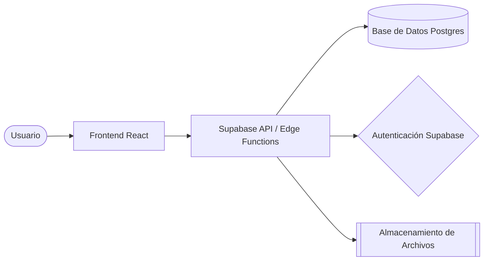

# 🏗️ TECHNICAL_SPEC.md
## Arquitectura de Sistema y Especificación Técnica

| Proyecto | {{PROJECT_NAME}} |
|----------|------------------|
| **MODUS AXON Hub** | [modus_axon](../modus_axon) |
| **Arquitecto de IA** | MODUS AXON - Agent |
| **Ultima Actualización** | {{DATE}} |
| **Versión** | v1.1.0 |

---

## 🏛️ Vista General de la Arquitectura (The High-level View)
*Descripción del flujo de datos entre capas (Frontend, API, DB).*

---

## 📊 Modelo de Datos (Data Schema - ERD)
*Relaciones principales y tablas clave.*

| Tabla | Propósito | Llaves Clave |
|-------|-----------|--------------|
| `users` | Perfiles y autenticación | `id` (UUID) |
| `projects` | Datos maestros de proyectos | `id` (UUID), `owner_id` (FK) |
| `tasks` | Tareas y sus estados | `id` (UUID), `project_id` (FK) |

---

## 🔗 Especificación de la API (API Design)
*Rutas críticas y su estructura de datos.*

### `POST /v1/auth/login`
- **Entrada**: `{ email: 'user@example.com', password: '***' }`
- **Salida**: `{ user: {...}, session: {...} }`

### `GET /v1/projects`
- **Entrada**: `Header Authorization: Bearer <TOKEN>`
- **Salida**: `Array<{ id, name, status, created_at }>`

---

## 🔒 Políticas de Seguridad (RBAC & RLS)
- **RLS (Row Level Security)**: Cada usuario solo puede ver sus propios registros en la tabla `tasks`.
- **JWT (JSON Web Tokens)**: Obligatorio para todas las solicitudes al backend.
- **Auditoría**: Cada cambio en `projects` se registra en la tabla `audit_log`.

---

## 🛠️ Herramientas de Desarrollo y Debugging
- **IDE**: VS Code + MDX Support
- **Chrome DevTools**: React Profiler & Network Inspector
- **Supabase CLI**: Para migraciones locales y testing.
- **Postman/Insomnia**: Para testing de endpoints.

---
**MODUS AXON** — Cualquier sistema, perfeccionado.
