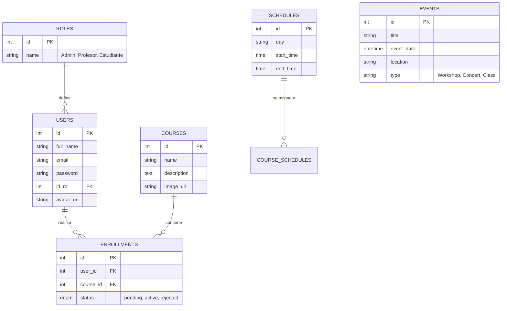
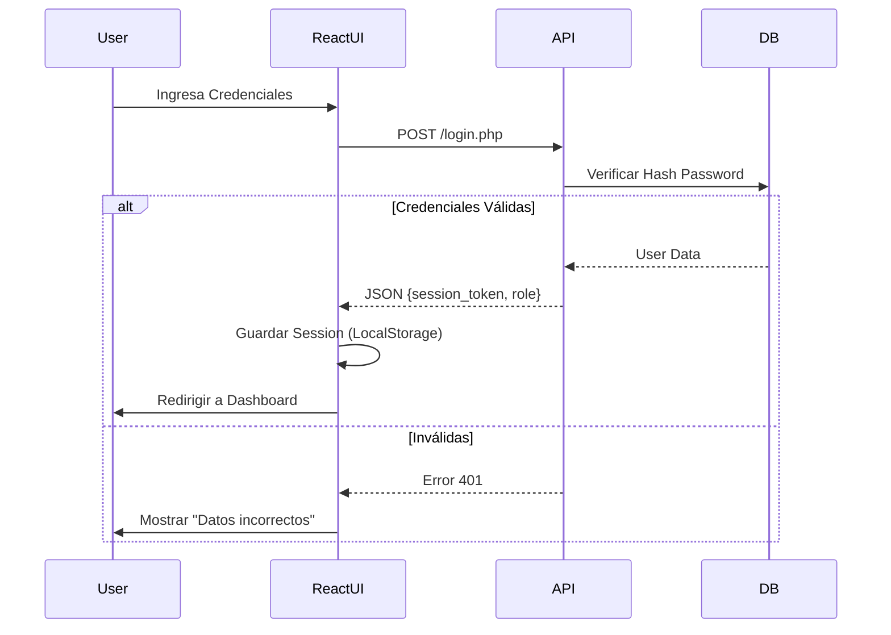
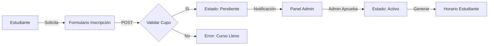

# 🏛️ Documentación Técnica - Project Jacquin

## 1. Arquitectura del Sistema
El sistema **Jacquin** sigue una arquitectura **Cliente-Servidor** desacoplada:

*   **Frontend**: Single Page Application (SPA) construida con **React.js** (Vite).
*   **Backend**: API RESTful construida con **PHP 8** nativo (sin frameworks pesados).
*   **Base de Datos**: **MySQL/MariaDB** relacional.
*   **Infraestructura**: Despliegue en InfinityFree (Hosting compartido) + Túnel Zrok para desarrollo local.

### Diagrama de Componentes
```mermaid
graph TD
    Client[Cliente Web (React)] <-->|JSON/HTTPS| API[API PHP Bridge]
    API <-->|SQL| DB[(MySQL Database)]
    API <--> FS[File System (Assets/Uploads)]
```

## 2. Diagrama Entidad-Relación (ERD)
Esquema inferido de la lógica de negocio actual:



## 3. Diagramas de Flujo de Procesos

### 3.1 Autenticación y Acceso


### 3.2 Gestión de Matrícula (Enrollment)


## 4. Requisitos del Sistema

### 4.1 Requisitos Funcionales (RF)
| ID | Requisito | Descripción |
| :--- | :--- | :--- |
| **RF-01** | **Gestión de Usuarios** | Registro, Login, Recuperación de contraseña y edición de perfil. |
| **RF-02** | **Roles y Permisos** | Diferenciación estricta entre Admin, Profesor y Estudiante. |
| **RF-03** | **Catalogo de Cursos** | Visualización pública de programas y detalle académico. |
| **RF-04** | **Inscripciones** | Flujo de solicitud de matrícula con aprobación administrativa. |
| **RF-05** | **Gestión de Eventos** | CRUD de eventos (conciertos, talleres) visible en el calendario. |
| **RF-06** | **Panel de Control** | Dashboard administrativo para gestión global (KPIs, tablas). |

### 4.2 Requisitos No Funcionales (RNF)
| ID | Requisito | Descripción |
| :--- | :--- | :--- |
| **RNF-01** | **Rendimiento** | Carga inicial del Hero < 1.5s (LCP). Imágenes optimizadas (WebP). |
| **RNF-02** | **Seguridad** | Passwords con Hash (Bcrypt). Protección CORS y saneamiento SQL. |
| **RNF-03** | **Disponibilidad** | Sistema resiliente a fallos de conexión (Manejo de estados offline básico). |
| **RNF-04** | **Usabilidad** | Diseño Responsive (Mobile First) adaptable a tablets y desktops. |
| **RNF-05** | **Escalabilidad** | Arquitectura modular que permite añadir nuevos módulos (ej. Pagos) sin refactorización total. |

## 5. Estructura de Archivos y Recursos (Assets)
A partir de la auditoría de febrero 2026, los recursos se han centralizado para optimización y compatibilidad con hosting compartido:

*   **Ruta Raíz Assets**: `web_page/pages/public/assets/`
    *   **images/**:
        *   `avatars/`: Contiene `default_avatar.svg`.
        *   `hero/`: Imágenes de la sección principal.
        *   `about/`: Recursos de la sección "Nosotros".
        *   `programs/`: Miniaturas de cursos.
        *   `values/`: Iconografía de valores institucionales.
    *   **fonts/**: Colección de fuentes oficiales del Brandbook (Poppins, HelveticaNeue, Marion).

### Beneficios:
1.  **Compatibilidad Hosting**: Rutas relativas consistentes en InfinityFree.
2.  **Rendimiento**: Mejor cacheo de recursos estáticos.
3.  **Orden**: Eliminación de carpetas duplicadas (`web_page/assets/`, `web_page/pages/images/`).

## 6. Arquitectura Micro-Frontend (MFE)
El sistema utiliza una estrategia de **Micro-Frontends** para componentes transversales como el **Header** y el **Footer**:

*   **Implementación**: Los componentes se desarrollan en React y se compilan mediante **esbuild** en bundles independientes (`react-footer.bundle.js`).
*   **Inyección**: Se montan en contenedores con IDs específicos (`react-footer-root`) en páginas HTML puras.
*   **Comunicación**: El intercambio de datos entre el código Vanilla (Dashboards) y los componentes React se realiza mediante **Custom Events** (`enrollment-status-updated`).
*   **Sincronización**: Al guardar cambios en el panel de administración, se dispara un evento global que el componente React escucha para actualizar su estado interno sin necesidad de recargar la página.

## 7. Historial de Cambios (Bitácora Diaria)
*   **Fecha:** 2026-02-23
    *   **Footer**: Migración total de estilos vanilla a React. Eliminación de redundancia CSS en `style.css`.
    *   **Reactividad**: Implementación de sistema de eventos para actualización en tiempo real de estados de matrícula.
    *   **Dashboards**: Unificación de la experiencia visual en todas las vistas administrativas y de estudiantes.
    *   **Lógica de Negocio**: Optimización del flujo de matrículas (Año de vigencia obligatorio en "Abierto", oculto y opcional en "Cerrado").
    *   **Codificación**: Resolución masiva de caracteres extraños (Mojibake) en modales y notificaciones.
    *   **Usuarios**: Corrección de `showToast is not defined` y unificación de lógica de eliminación de usuarios en `admin_users.html`.
    *   **Despliegue**: Generación de build de producción y sincronización limpia a la carpeta `htdocs`.
