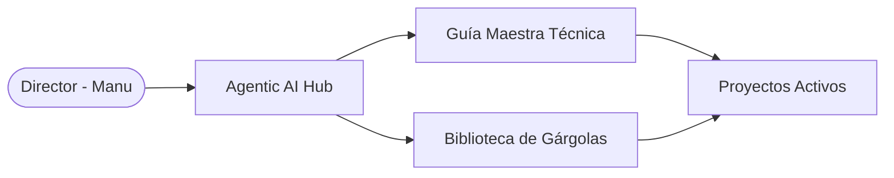

# 🏗️ TECHNICAL_SPEC.md
## Arquitectura de Sistema y Especificación Técnica del Hub

| Proyecto | MODUS AXON |
|----------|------------------|
| **MODUS AXON Hub** | [modus_axon](./) |
| **Arquitecto de IA** | MODUS AXON - Architect |
| **Ultima Actualización** | 2026-03-06 |
| **Versión** | v1.1.0 |

---

## 🏛️ Vista General de la Arquitectura (The High-level View)
*Descripción del flujo de datos entre capas (Frontend, API, DB).*

---

## 📊 Modelo de Datos (Data Schema - ERD)
*Relaciones principales del ecosistema.*

| Entidad | Propósito | Estructura |
|-------|-----------|--------------|
| `standard` | Protocolo obligatorio | `/technical/GUIA_DOCUMENTACION.md` |
| `models` | Biblioteca de plantillas | `/technical/models/` |
| `build_logs` | Trazabilidad de acciones de IA | `/technical/BUILD_PROJECT.html` |
| `ai_compliance` | Cumplimiento legal | `/AI_LOG_CUMPLIMIENTO.md` |

---

## 🔒 Políticas de Seguridad y Trazabilidad
- **Bitácora de Construcción**: Registro de cada comando del Director (Prompt) para auditoría.
- **AI Log de Cumplimiento**: Registro de decisiones de arquitectura ética (GDPR/Ley 1581).
- **Control de Versiones**: Uso estricto de Git para ramas y despliegue.

---

## 🛠️ Herramientas de Desarrollo
- **Visual Studio Code** (IDE principal).
- **Antigravity** (Cerebro IA Orchestrator).
- **Git** (Gestión de cambios y despliegue).

---
**MODUS AXON** — Cualquier sistema, perfeccionado.
